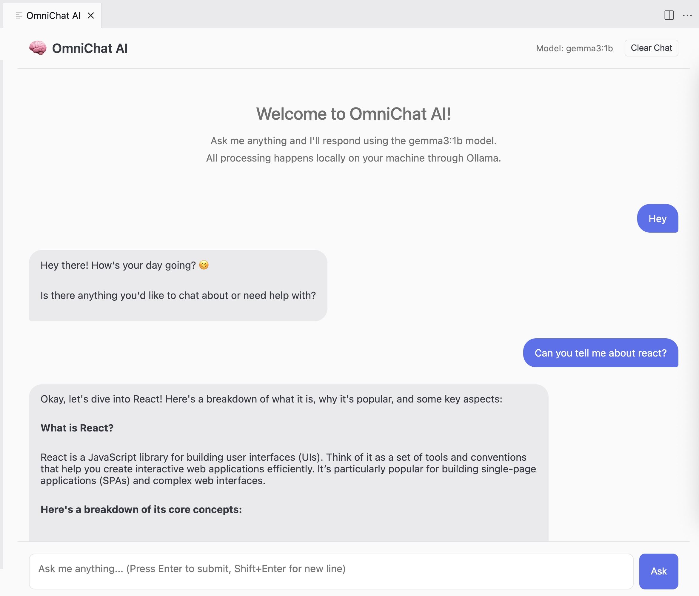
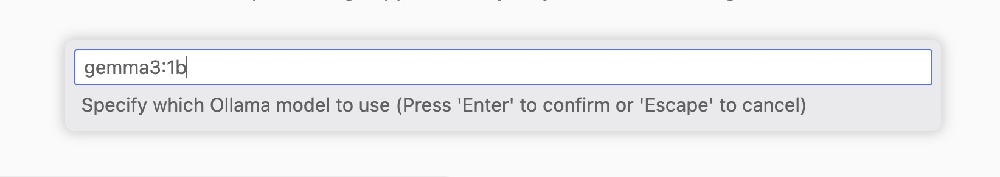

# OmniChat AI 🧠💻

A privacy-first VS Code extension that integrates with any local LLM through Ollama. Chat with AI models directly in your editor without sending data to the cloud.




- **Works with Any LLM**: Use DeepSeek, Gemma, Llama, or any other model available through Ollama
- **Real-Time AI Interaction**: Get coding assistance, brainstorm ideas, and debug issues without leaving VS Code
- **Privacy-First**: All processing happens locally - your code and data never leave your machine
- **Beautifully Formatted Responses**: Clean markdown rendering for better readability
- **Seamless Integration**: Matches VS Code's themes for a consistent experience

## Installation

### Prerequisites
- [Visual Studio Code](https://code.visualstudio.com/)
- [Ollama](https://ollama.ai/) installed and running locally

### Quick Install
1. Install from VS Code Marketplace:
   - Open VS Code
   - Go to Extensions (Ctrl+Shift+X)
   - Search for "OmniChat AI"
   - Click Install

2. Install your preferred LLM with Ollama:
   ```bash
   ollama pull deepseek-r1:1.5b
   # Or any other model you prefer
   ```

## Usage

1. Start Ollama in your terminal:
   ```bash
   ollama serve
   ```

2. In VS Code:
   - Open Command Palette (Ctrl+Shift+P)
   - Run `OmniChat: Start`
   - A chat panel will open

3. Set your preferred model:
   - Open Command Palette (Ctrl+Shift+P)
   - Run `OmniChat: Set Model`
   - Enter the model name (e.g., `deepseek-r1:1.5b`, `gemma:7b`, etc.)

4. Start chatting!
   - Type your question and click "Ask"
   - Receive beautifully formatted responses

## Models

OmniChat AI works with any model available through Ollama. Some popular options:

- `deepseek-r1:1.5b` - Fast, lightweight coding assistant
- `deepseek-r1:8b` - Good balance of speed and capability
- `deepseek-r1:32b` - Most capable DeepSeek model
- `gemma:7b` - Google's lightweight model
- `llama3:8b` - Meta's efficient model

## Credits

This project was inspired by [Fireship's video](https://www.youtube.com/@Fireship) on building VS Code extensions.

Special thanks to [Ollama](https://ollama.ai/) for enabling local AI capabilities.

## License

This project is licensed under the MIT License.